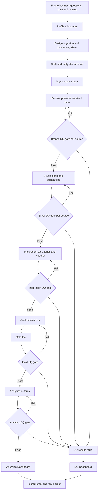

# NYC Mobility Pipeline

A Databricks lakehouse pipeline combining NYC Green Taxi trips, historical
Open-Meteo weather observations, and NYC Taxi Zone reference data.



The pipeline is designed for traceable ingestion, explicit data-quality gates,
safe reruns, and reproducible analytical outputs.

> **Status:** Active development. Source profiling, architecture, ingestion
> contracts, and the Gold model are documented. The complete pipeline has not
> yet been orchestrated and validated end to end.

## Data sources

| Source | Purpose | Format |
|---|---|---|
| [NYC TLC Green Taxi records](https://www.nyc.gov/site/tlc/about/tlc-trip-record-data.page) | Trip-level mobility activity | Parquet |
| [Open-Meteo Historical API](https://open-meteo.com/en/docs/historical-weather-api) | Hourly NYC weather observations | JSON |
| [NYC Taxi Zone lookup](https://d37ci6vzurychx.cloudfront.net/misc/taxi_zone_lookup.csv) | Pickup and drop-off zone reference | CSV |

The official source registry is maintained in
[`config/sources.json`](config/sources.json).

Raw source data is stored in the class R2-backed Databricks Volume. Raw datasets
and large outputs are not committed to GitHub.

## Platform configuration

| Setting | Value |
|---|---|
| Platform | Databricks |
| Catalog | `ftw-week-08` |
| Source schema | `00-source` |
| Source Volume | `group_a_source` |
| Volume path | `/Volumes/ftw-week-08/00-source/group_a_source/` |
| Reporting timezone | `America/New_York` |
| Proof period | March–May 2026 |
| Implementation languages | Python and SQL |

Expected source layout:

```text
/Volumes/ftw-week-08/00-source/group_a_source/
├── green_taxi/
├── taxi_zones/
├── weather/
└── traffic_advisory/
```

Traffic advisories are optional and are not part of the required pipeline.

## Repository structure

```text
nyc-mobility-pipeline/
├── README.md               # what this is, how to run it
├── CONTRIBUTING.md
├── databricks.yml          # the job: 30 tasks, dependencies enforce the gates
├── requirements-dev.txt
│
├── .github/                # issue and PR templates, CI
├── config/                 # non-secret project, naming and source configuration
├── src/ingestion/          # unused, see "Known limitations"
│
├── etl/                    # the pipeline, in execution order
│   ├── 01_control/         # control tables, the shared DQ contract, control gate
│   ├── 02_bronze/          # one loader and one gate per source
│   ├── 03_silver/          # one cleaner and one gate per source
│   ├── 04_integration/     # trip-to-zone and trip-to-weather key maps, gate
│   ├── 05_gold/            # four dimensions, two facts, gate
│   └── 06_analytics/       # one dataset per business question, gate
│
├── notebooks/              # source profiling and investigation
├── tests/                  # repository policy checks, run by CI
│
├── docs/                   # architecture, model, dictionary, decisions, validation
│   └── model/              # star schema diagram
│
└── evidence/proof/         # incremental, idempotency, restart and full-run proofs
```

Each layer folder holds numbered files that run in order: loaders or transforms
first, then `90_validate_<source>` as that layer's gate. A gate raises on failure,
so the task fails and everything downstream is skipped.


### Directory responsibilities

| Location | Responsibility |
|---|---|
| `config/` | Approved non-secret project, naming, and source configuration |
| `src/ingestion/` | Unused. Superseded by the SQL loaders in `etl/02_bronze/` |
| `etl/` | Ordered SQL tasks, one folder per pipeline stage |
| `notebooks/` | Source profiling and limited investigation |
| `tests/` | Policy, source-format, and reusable-code tests |
| `docs/` | Canonical architecture, model, mapping, ingestion, and validation decisions |
| `evidence/proof/` | Reviewed run, reconciliation, and rerun evidence |

Every file under `etl/` is SQL. Business logic lives there and is not duplicated
into notebooks. Commit notebooks in Databricks source format, not `.ipynb`, so
pull requests show readable diffs and no cell output is committed.

### Known limitations

Every stage from Control through Analytics is implemented and runs. What follows
is what a reader should not assume.

| | |
|---|---|
| `src/ingestion/*.py` | **Unused.** The Bronze loaders were rewritten as SQL. `batch_tracking.py` and `schema_drift_check.py` remain in the tree but nothing imports them. |
| Landing paths | Literals inside `read_files`, which cannot take a variable. Staging a subset of files for a test means moving files in the Volume. |
| `code_revision` | Every gate stamps `'UNSET'`. A job parameter cannot reach it, because it is a `DECLARE OR REPLACE VARIABLE` rather than a parameter marker. |
| Schema drift | A **missing** source column fails loudly; a **new** one is silently ignored by the explicit column lists. |
| Weather coverage | The series was requested in UTC while trips are local, so 180 trips have no weather hour. Weather measures cover 133,173 of 133,353 (D20). |
| `supersedes_batch_id` | The column exists and is not populated (D24). |
| NYC DOT advisories | Deferred (D02). No traffic fact, dimension or bridge exists. |

## Architecture and tables

| Stage | Purpose | Code | Destination |
|---|---|---|---|
| 00 Source | Immutable source files | R2-backed Volume | No project tables |
| 01 Control | Runs, batches, checkpoints, and DQ results | `etl/01_control/` | `01-control` |
| 02 Bronze | Source-preserving records with provenance | `etl/02_bronze/` | `02-bronze` |
| 03 Silver | Typed, standardized, and quality-reviewed records | `etl/03_silver/` | `03-silver` |
| 04 Integration | Resolve trips to zones and weather | `etl/04_integration/` | Published through Gold |
| 05 Gold | Approved facts and dimensions | `etl/05_gold/` | `05-gold` |
| 06 Analytics | Business-question datasets | `etl/06_analytics/` | `06-analytics` |

Stage numbers describe execution order. Stage 00 creates no project tables.
Stage 04 does not have its own schema because integration enriches trips without
introducing a separate analytical grain.

## Gold model

The approved model contains two facts and four shared dimensions:

| Table | Grain |
|---|---|
| `fact_taxi_trip` | One row per accepted Green Taxi trip |
| `fact_weather_hourly` | One row per coordinate, UTC observation hour, and weather model |
| `dim_date` | One row per NYC-local calendar date |
| `dim_hour` | One row per hour from 0 through 23 |
| `dim_taxi_zone` | One row per Taxi Zone `LocationID` |
| `dim_weather_classification` | One row per weather-code and precipitation-band combination |

Taxi and weather facts do not join directly. A trip receives the weather
classification associated with its pickup hour. Temperature and precipitation
remain in `fact_weather_hourly`, preventing those measurements from being
multiplied across trip rows.

See [`docs/data_model.md`](docs/data_model.md) for keys, measures, nullable
relationships, classifications, and business-question mappings.

## Quick start

### 1. Prerequisites

You need:

- Git and access to this repository.
- Access to the team Databricks workspace.
- Permission to use the `ftw-week-08` catalog.
- Read access to the `group_a_source` Volume.
- A personal Databricks Git folder.
- An assigned GitHub issue and reviewer.

The full pipeline cannot currently run locally because it depends on Spark,
Unity Catalog, Databricks Volumes, and `dbutils`.

### 2. Clone the repository

```bash
git clone https://github.com/hyenalouise/nyc-mobility-pipeline.git
cd nyc-mobility-pipeline
git switch main
git pull --ff-only
```

Create one branch for one issue:

```bash
git switch -c <type>/issue-<number>-<short-description>
```

Example:

```bash
git switch -c ingestion/issue-20-taxi-files
```

### 3. Review configuration

The tracked non-secret configuration files are:

```text
config/project.json
config/naming.yml
config/sources.json
```

For temporary personal overrides:

```bash
cp config/project.json config/project.local.json
```

`config/project.local.json` is ignored by Git.

Never store Databricks tokens, R2 credentials, passwords, or other secrets in
project configuration.

### 4. Create a Databricks Git folder

In Databricks:

1. Create a personal Git folder using this repository URL.
2. Authenticate using your GitHub account.
3. Check out your assigned branch.
4. Attach approved class compute.
5. Confirm access to the catalog and source Volume.

Do not share Databricks Git folders between developers.

### 5. Verify access

Run in a Databricks SQL cell:

```sql
SHOW SCHEMAS IN `ftw-week-08`;
```

Run in a Python cell:

```python
display(
    dbutils.fs.ls(
        "/Volumes/ftw-week-08/00-source/group_a_source/"
    )
)
```

Expected folders include:

```text
green_taxi
taxi_zones
weather
```

If access fails, stop and request access. Do not replace approved shared paths
with personal paths in committed code.

## Execution order

Run approved entry points in this order:

```text
01 Control
→ 02 Bronze
→ Bronze validation (per source)
→ 03 Silver
→ Silver validation (per source)
→ 04 Integration
→ Integration validation
→ 05 Gold dimensions
→ 05 Gold facts
→ Gold validation
→ 06 Analytics
→ Analytics validation
```

Within a stage:

```text
00  Setup or table creation
10  First task
20  Next task
30  Next task
90  Validation gate: one file per source in Bronze and Silver;
    one file per stage from Integration onward
```

Do not run a downstream trusted stage while an upstream critical validation is
failing. In Bronze and Silver, a source may advance when its own gate passes;
Integration and Gold require every source's Silver gate to pass. See
[`docs/validation.md`](docs/validation.md).

## Naming rules

All persisted tables must use fully qualified references:

```sql
SELECT *
FROM `ftw-week-08`.`02-bronze`.`green_taxi_raw`;
```

Catalog and schema names require backticks because they contain hyphens and
begin with numbers.

Do not depend on a previous `USE CATALOG` or `USE SCHEMA` command.

Outside source-preserving Bronze fields:

- Use lowercase `snake_case`.
- Use `_id` for identifiers.
- Use `_at` for timestamps.
- Use `_date` for dates.
- Use `_count` for counts.
- Use `_amount` for currency.
- Use `_flag` for Boolean indicators.

## Validation requirements

Every data-affecting pull request must include:

- Source version, checksum, or request window.
- Databricks Runtime used.
- Source and target row counts.
- Accepted, rejected, and quarantined counts.
- Duplicate and key-uniqueness checks.
- Null and required-field checks.
- Measure reconciliation where applicable.
- Evidence that records were not silently dropped.
- Rerun or idempotency evidence where applicable.
- Anything not yet validated.

An identical-input rerun must preserve business content and must not create
duplicates. Equal row counts alone do not prove idempotency.

Commit small reviewed evidence under:

```text
evidence/proof/
```

Do not commit raw datasets, full table exports, notebook result data, or large
execution logs.

## Local checks

Run the same checks as CI before opening a pull request:

```bash
python -m pip install -r requirements-dev.txt
python -m pytest tests
git diff --check
```

`tests/test_repo_policy.py` checks:

- `.py`, `.json` and `.yml` files parse
- no `.ipynb` outside `notebooks/`
- files under `etl/` follow `NN_lowercase_name.sql` or `.py` in a known layer folder
- Python files under `etl/` are Databricks source-format notebooks
- table names do not begin with a digit (the `90_` prefix is for file names only)
- no trailing whitespace, except on Databricks markdown lines (`# MAGIC` / `-- MAGIC`), where two trailing spaces are a Markdown line break
- schema references include the catalog

Test files that are Databricks notebooks are skipped locally (see
`tests/conftest.py`) and run in Databricks.

### Continuous integration

`.github/workflows/ci.yml` runs on every pull request to `main` and on every
push to `main`:

| Job | Fails when |
|---|---|
| Repository checks | `git diff --check` finds whitespace errors, or `python -m pytest tests` fails |
| PR links an issue | The PR description has no `Closes #N`, `Part of #N`, or `Related to #N` |

CI does not connect to Databricks and does not run the pipeline.

## Development workflow

Start from current `main`:

```bash
git switch main
git pull --ff-only
git switch -c <type>/issue-<number>-<short-description>
```

Review changes before committing:

```bash
git status
git diff
git diff --check
```

Commit only intended files:

```bash
git add <specific-paths>
git commit -m "<clear description>"
git push -u origin <branch-name>
```

Every pull request must:

- Include `Closes #<issue-number>`.
- Explain what changed and why.
- Explain what was run or checked.
- Include counts or evidence when data is affected.
- Identify anything not yet validated.
- Receive the assigned teammate’s review.

See [`CONTRIBUTING.md`](CONTRIBUTING.md) for ownership, branch naming, and
review rules.

## Documentation map

| Document | Purpose |
|---|---|
| [`docs/architecture.md`](docs/architecture.md) | Stage-by-stage data flow |
| [`docs/naming_conventions.md`](docs/naming_conventions.md) | Catalog, schemas, tables, columns, and paths |
| [`docs/data_model.md`](docs/data_model.md) | Facts, dimensions, grains, keys, and measures |
| [`docs/data_dictionary.md`](docs/data_dictionary.md) | Target fields, types, and business meanings |
| [`docs/source_profile.md`](docs/source_profile.md) | Observed source structure and quality |
| [`docs/source_to_target_mapping.md`](docs/source_to_target_mapping.md) | Source-to-target transformations |
| [`docs/ingestion.md`](docs/ingestion.md) | Batch identity, reruns, and recovery |
| [`docs/validation.md`](docs/validation.md) | Required checks and acceptance evidence |
| [`docs/decisions.md`](docs/decisions.md) | Accepted decisions and rejected alternatives |
| [`docs/job_setup.md`](docs/job_setup.md) | How to wire the pipeline as a Databricks job, task by task |

If documentation and implementation disagree, stop and resolve the discrepancy
through the relevant issue. Do not silently choose one.

## Security and repository hygiene

Never commit:

- Databricks tokens.
- R2 credentials.
- Passwords or secret values.
- `.databrickscfg`.
- Raw Parquet, CSV, or JSON datasets.
- Local processing state.
- Notebook outputs containing data or configuration.
- Large generated evidence.

GitHub stores code, documentation, non-secret configuration, and compact
reviewed evidence. R2 and Databricks store source data and persisted tables.

## Remaining handoff requirements

Before claiming a reproducible end-to-end pipeline, the project must:

- Pin the supported Databricks Runtime.
- Pin external Python dependencies, if any.
- Implement all required ETL files.
- Provide one orchestration job or exact manual runbook.
- Run March, April, and May in order.
- Prove identical-input rerun safety.
- Demonstrate recovery after a controlled failure.
- Reconcile final Bronze, Silver, Gold, and Analytics outputs.

Progress and ownership are tracked through the
[GitHub Project board](https://github.com/users/hyenalouise/projects/3) and
[repository issues](https://github.com/hyenalouise/nyc-mobility-pipeline/issues).
